# 1.1.1.4. Questionário

## Introdução
Este documento tem o propósito de apresentar os resultados do questionário realizado pelo Grupo 4 para a disciplina de Arquitetura de Software, ministrada no período 2026.1 pela docente Milene Serrano. 

O questionário é uma técnica estruturada utilizada para coletar informações de um conjunto de stakeholders (usuários, clientes, especialistas etc.). Ele é composto por uma série de perguntas fechadas, abertas ou mistas, que podem ser aplicadas presencialmente ou de forma online.

## Objetivo

O presente questionário foi elaborado com o propósito de conhecer melhor os possíveis usuários do aplicativo FCTE Hoje, uma solução voltada à divulgação das principais notícias do dia no ambiente da FCTE (Faculdade de Ciências e Tecnologias em Engenharia). O projeto tem como foco informar e engajar o público universitário, disponibilizando notícias acadêmicas, palestras previstas, cardápio do RU, eventos, editais abertos e outras informações relevantes.

Dessa forma, buscou-se compreender por que o aplicativo deveria existir, quais funcionalidades são consideradas essenciais pelos usuários e qual é o perfil predominante do público-alvo. Todos os dados foram coletados com o consentimento dos respondentes, e nenhuma informação sensível, como nome, CPF, telefone ou e-mail, foi solicitada. Ao todo, foram registradas XX respostas.

## Metodologia

O questionário utilizado nesta pesquisa foi dividido em duas seções principais, cada uma com objetivos específicos voltados a entender o perfil dos participantes e identificar as necessidades relacionadas ao aplicativo FCTE Hoje.

A **primeira seção teve como objetivo coletar informações gerais sobre os participantes, permitindo traçar um perfil dos usuários da FCTE**. Foram obtidos dados como sexo/gênero, faixa etária, vínculo institucional, período cursado (no caso de estudantes) e os meios que utilizam para acessar informações sobre a FCTE. Também foram analisadas a frequência com que os participantes buscam notícias institucionais, os tipos de conteúdo que mais procuram e os dispositivos que utilizam com maior frequência.

A **segunda seção buscou identificar os principais problemas enfrentados pelos usuários ao tentar acessar informações da FCTE, além de levantar funcionalidades consideradas importantes para o desenvolvimento do FCTE Hoje**. Foram avaliados desafios relacionados à comunicação institucional, recursos que os usuários gostariam de ver no aplicativo e plataformas da FCTE que consideram importante integrar ao sistema. Também foram registradas as preferências dos participantes sobre como desejam receber notificações.

O questionário foi finalizado com uma pergunta aberta, permitindo que os participantes deixassem sugestões sobre o que consideram essencial no FCTE Hoje. Todas as respostas foram **coletadas de forma anônima** e utilizadas exclusivamente para análise e elicitação de requisitos.

## Gráficos dos resultados 

Esta seção apresenta os resultados em formato de gráficos para facilitar a visualização e interpretação dos dados coletados. As respostas foram obtidas entre os dias 28 e 31 de Março de 2026 e estão dividas em **Perfil de Usuário** e **Sobre o FCTE Hoje**. Foram obtidas **36 Respostas** até o presente momento

### Perfil de usuário

<strong>Gráfico 1: Aprovação do termo de consentimento. </strong>

**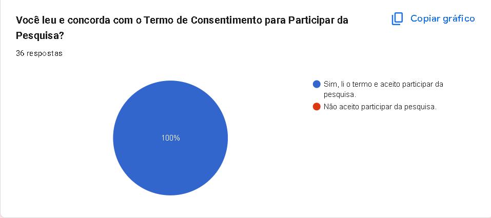**

<em>Autor: <a href="https://github.com/VilmarFagundes">Vilmar Fagundes</a>.</em>

<strong>Gráfico 2: Gênero. </strong>

**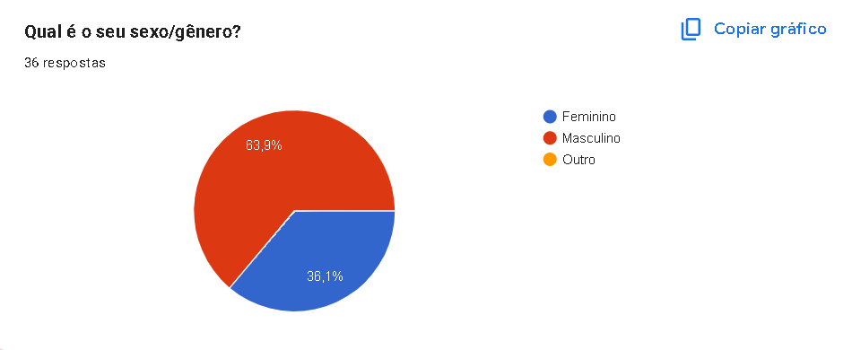**

<em>Autor: <a href="https://github.com/VilmarFagundes">Vilmar Fagundes</a>.</em>

<strong>Gráfico 3: Faixa etária. </strong>

**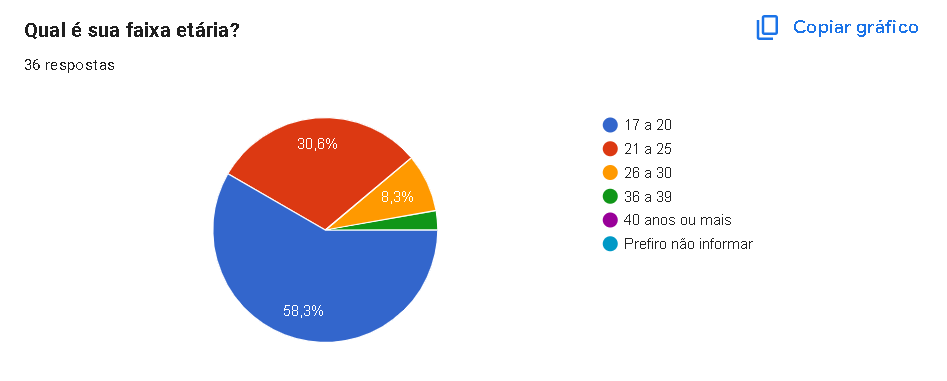**

<em>Autor: <a href="https://github.com/VilmarFagundes">Vilmar Fagundes</a>.</em>

<strong>Gráfico 4: Vínculo com a FCTE. </strong>

**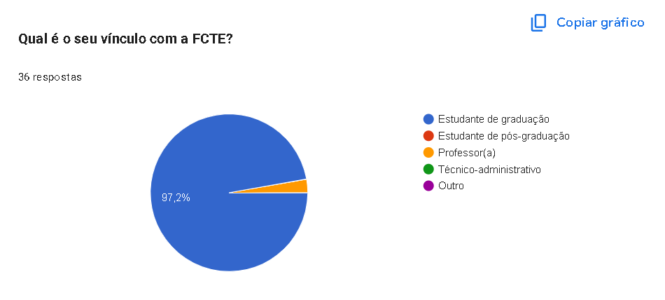**

<em>Autor: <a href="https://github.com/VilmarFagundes">Vilmar Fagundes</a>.</em>

<strong>Gráfico 5: Período do curso. </strong>

**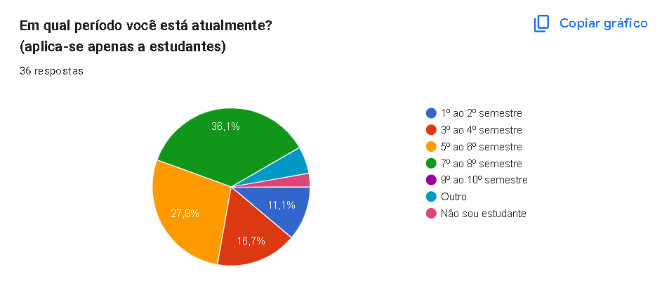**

<em>Autor: <a href="https://github.com/VilmarFagundes">Vilmar Fagundes</a>.</em>

<strong>Gráfico 6: Buscar Informações. </strong>

**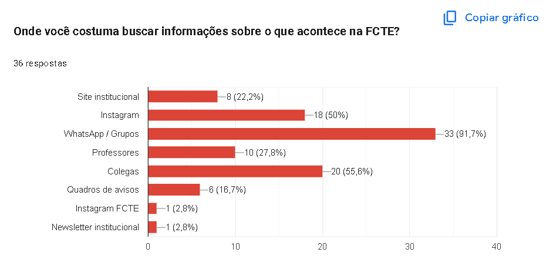**

<em>Autor: <a href="https://github.com/VilmarFagundes">Vilmar Fagundes</a>.</em>

<strong>Gráfico 7: Frequência em acessar notícias. </strong>

**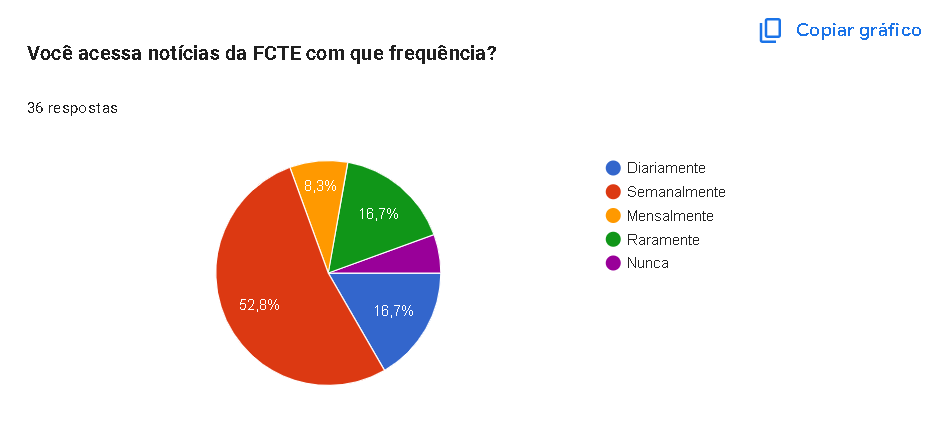**

<em>Autor: <a href="https://github.com/VilmarFagundes">Vilmar Fagundes</a>.</em>

<strong>Gráfico 8: Tipo de conteúdo mais buscado. </strong>

**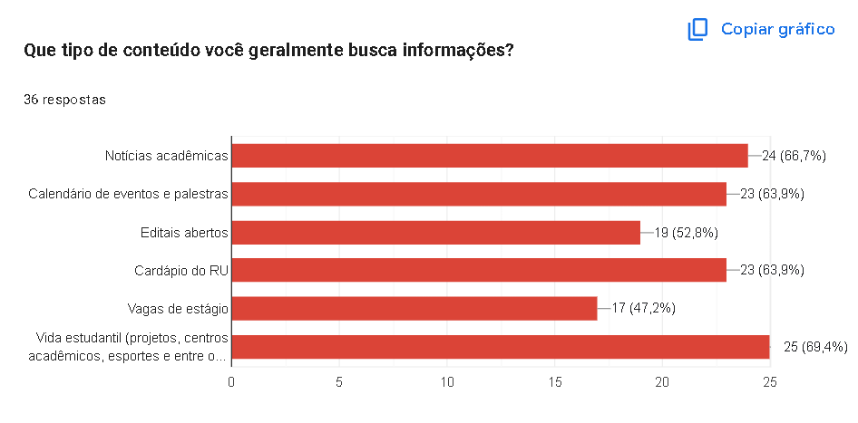**

<em>Autor: <a href="https://github.com/VilmarFagundes">Vilmar Fagundes</a>.</em>

<strong>Gráfico 9: Plataformas mais usadas. </strong>

**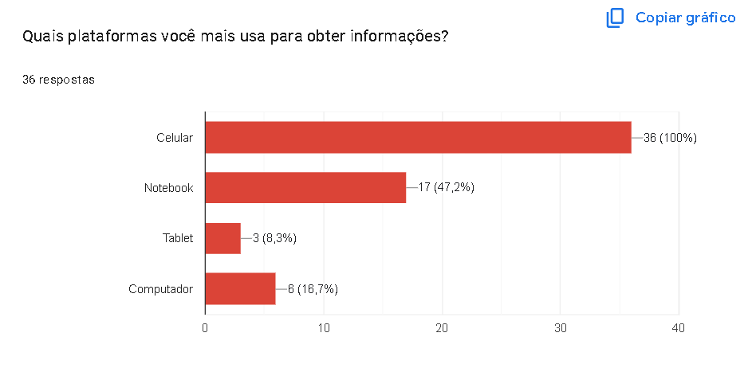**

<em>Autor: <a href="https://github.com/VilmarFagundes">Vilmar Fagundes</a>.</em>

### Sobre o FCTE Hoje

<strong>Gráfico 10: Pricipais desafios. </strong>

**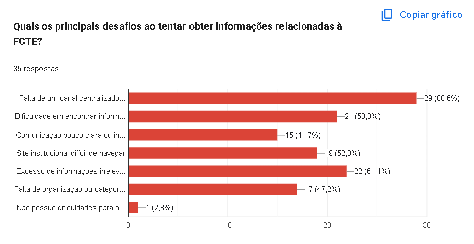**

<em>Autor: <a href="https://github.com/VilmarFagundes">Vilmar Fagundes</a>.</em>

<strong>Gráfico 11: Funcionalidades essenciais. </strong>

**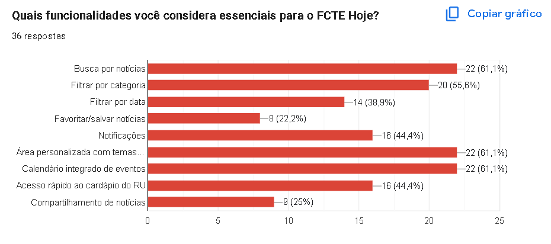**

<em>Autor: <a href="https://github.com/VilmarFagundes">Vilmar Fagundes</a>.</em>

<strong>Gráfico 12: Plataformas da FCTE para integrar ao projeto. </strong>

**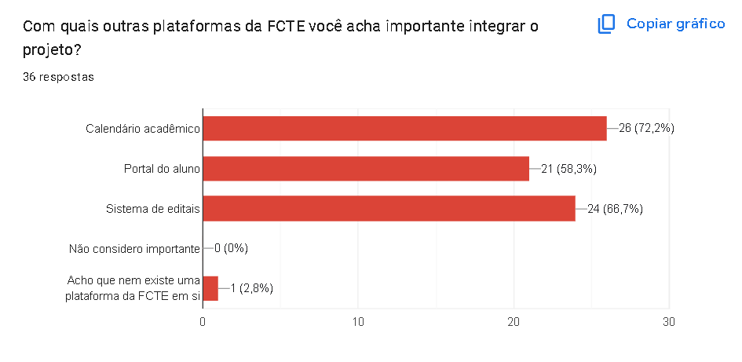**

<em>Autor: <a href="https://github.com/VilmarFagundes">Vilmar Fagundes</a>.</em>

<strong>Gráfico 12: Preferência de notificação. </strong>

**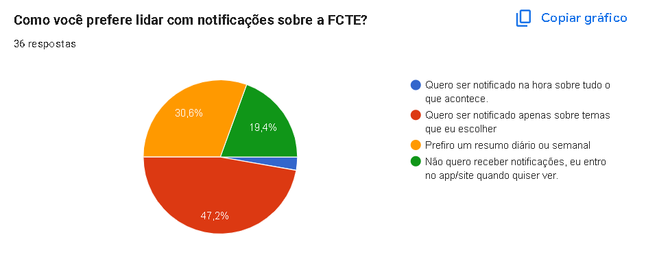**

<em>Autor: <a href="https://github.com/VilmarFagundes">Vilmar Fagundes</a>.</em>

<strong>Imagem 1: Sugestões para o projeto. </strong>

**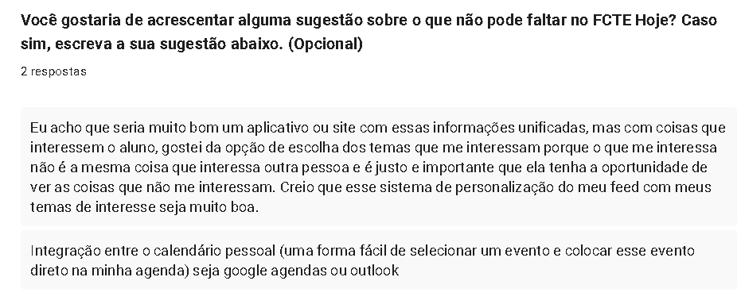**

<em>Autor: <a href="https://github.com/VilmarFagundes">Vilmar Fagundes</a>.</em>

## Requisitos Elicitados
Essa seção tratará dos requisitos elicitados a partir do questionário, apresentados por meio da Tabela 1 relacionada apenas a requisitos funcionais, tendo em vista que nenhum requisito não funcional foi elicitado durante o questionário.

Com a intenção de manter a rastreabilidade dos requisitos, a legenda seguirá o seguinte padrão:

- **QTRFX** : Requisito de tipo Funcional n° X

<strong>Tabela 1: Requisitos Funcionais </strong>

| Identificador | Descrição |
| :---: | ----- |
| QTRF1 | O sistema deve ser adaptado para o Mobile |
| QTRF2 | O sistema deve apresentar informações sobre notícias acadêmicas |
| QTRF3 | O sistema deve apresentar informações sobre calendário de eventos e palestras |
| QTRF4 | O sistema deve apresentar informações sobre editais abertoes |
| QTRF5 | O sistema deve apresentar informações sobre o cardápio do RU |
| QTRF6 | O sistema deve apresentar informações sobre vida estudantil (projetos, centros academicos, esporte) |
| QTRF7 | O sistema deve centralizar as principais informações da semana |
| QTRF8 | O sistema deve apresentar informações atualizadas |
| QTRF9 | O sistema deve permitir ao usuário filtrar as informações que tem interesse |
| QTRF10 | O sistema deve permitir ao usuário buscar notícias |
| QTRF11 | O sistema deve Ter uma seção com temas de interesse do usuário |
| QTRF12 | O sistema deve possuir um calendário com os eventos |
| QTRF13 | O sistema deve filtrar as notícias por categoria |
| QTRF14 | O sistema deve possuir o calendário acadêmico |
| QTRF15 | O sistema deve possuir integração com o portal do aluno |
| QTRF16 | O sistema deve possuir integração com o sistema de editais |
| QTRF17 | O sistema deve enviar notificações sobre temas que o usuário selecionar |
| QTRF18 | O sistema deve enviar notificações sobre um resumo diário ou semanal |
| QTRF19 | O sistema deve possuir uma integração com o calendário pessoal (podendo adicionar na agenda pessoal do usuário) |

<em>Autor: <a href="https://github.com/TiagoTeixeira-2005">Tiago Lemes</a>. e <a href="https://github.com/VilmarFagundes">Vilmar Fagundes</a></em>

## Referência Bibliográfica
> Barbosa, S. D. J.; Silva, B. S. da; Silveira, M. S.; Gasparini, I.; Darin, T.; Barbosa, G. D. J. (2021)Interação Humano-Computador e Experiência do usuário. Autopublicação. ISBN: 978-65-00-19677-1. Item: 7.5.4, Acesso em 28 mar. 2026

## Histórico de versões
| Versão | Data | Descrição | Autor(es) | Revisor(es) | Data da revisão |
|--------|------|-----------|-----------|-------------|-----------------|
| `1.0` | 28/03/2026 | Criação do documento. | [Tiago Lemes](https://github.com/TiagoTeixeira-2005)  | [Vilmar José](https://github.com/VilmarFagundes) | 31/03/2026 |
| `1.1` | 231/03/2026 | Adição dos resultados obtidos e dos requisitos elicitados. | [Vilmar José](https://github.com/VilmarFagundes) | [Tiago Lemes](https://github.com/TiagoTeixeira-2005) | 31/03/2026 |
