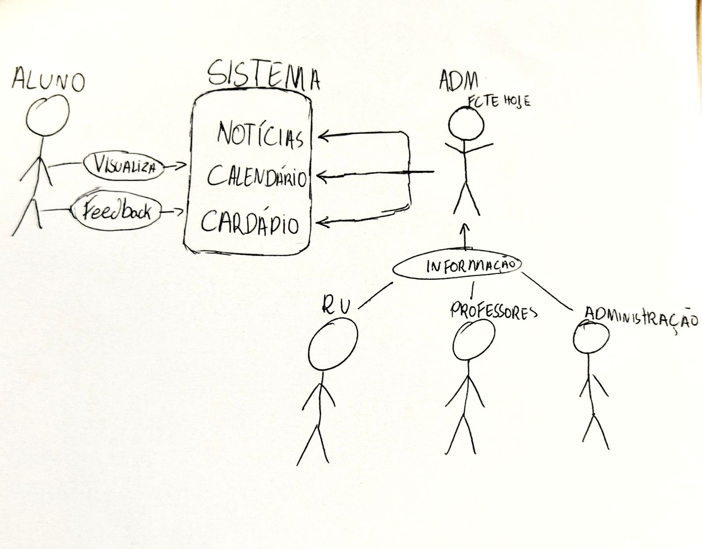
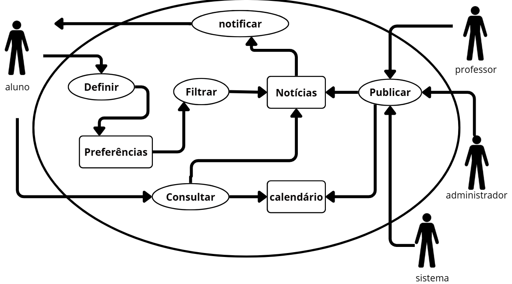
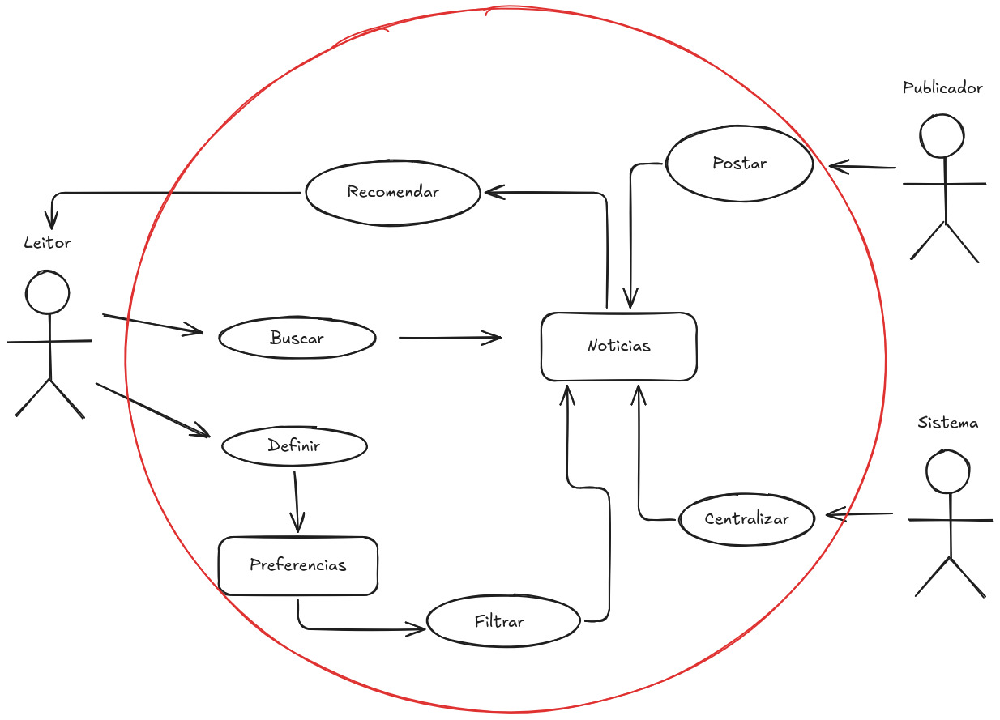
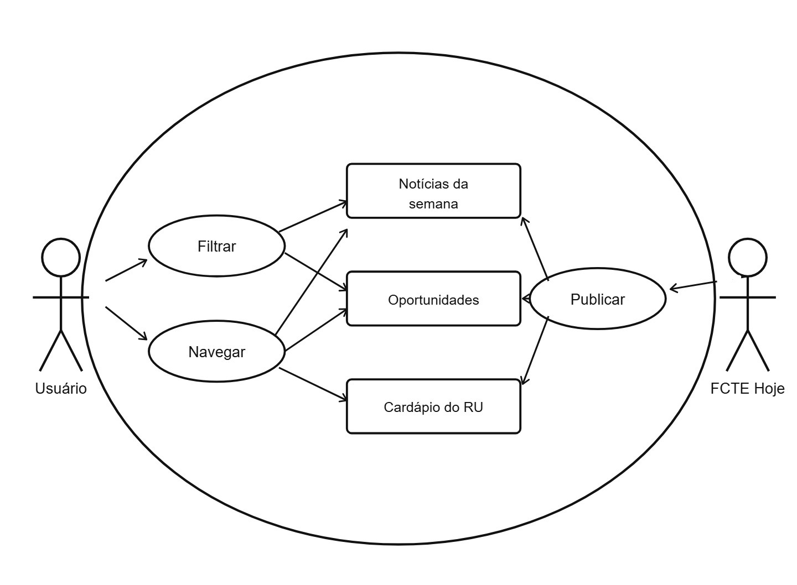
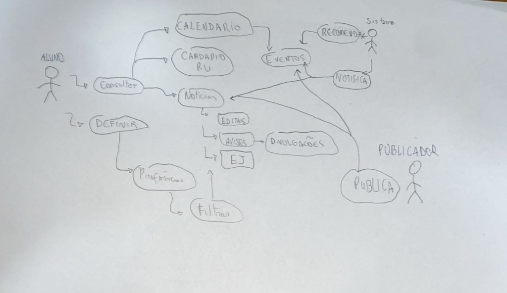
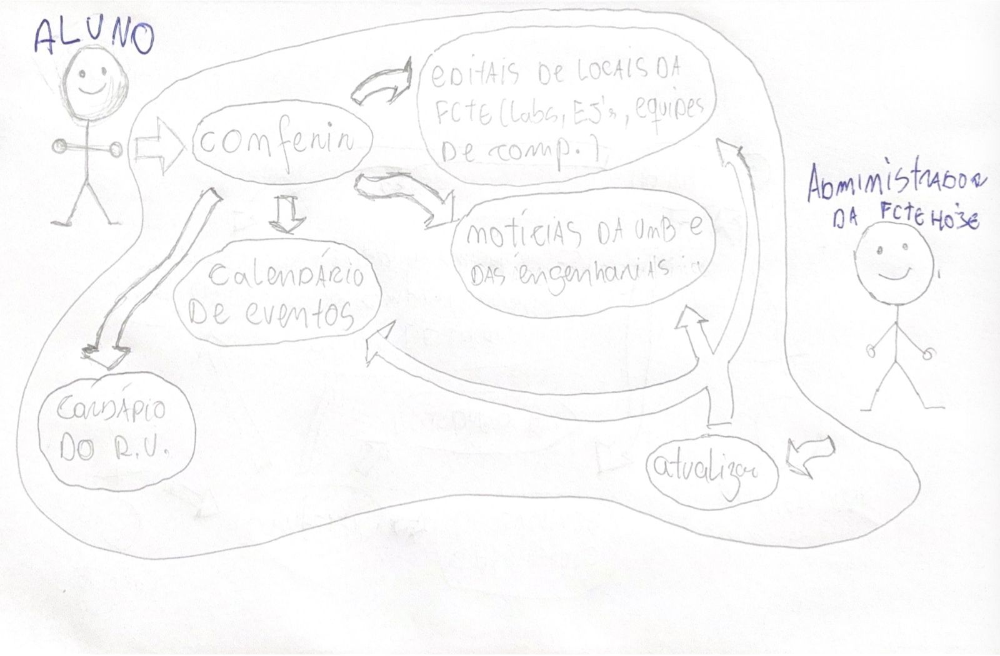
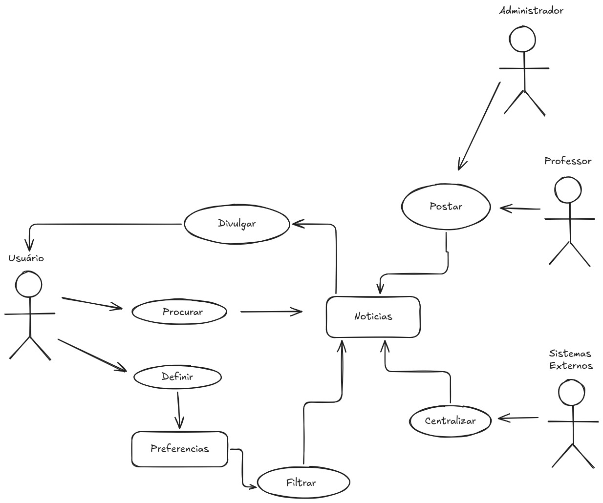
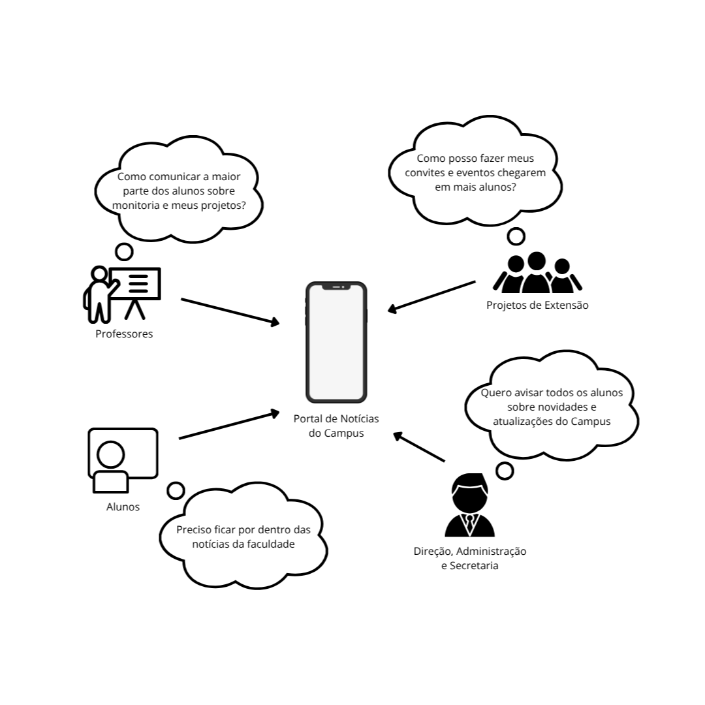
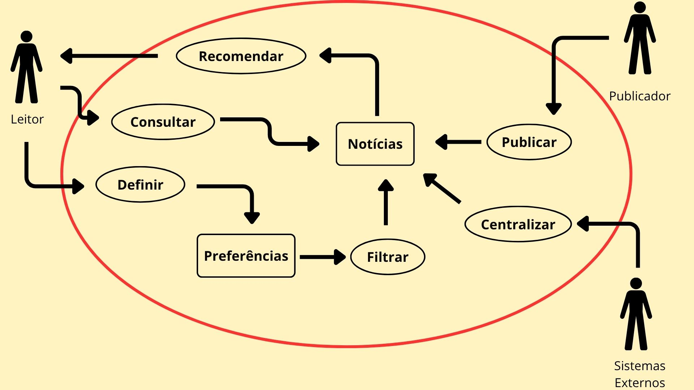
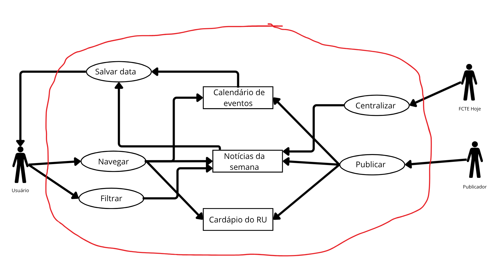

# 1.1.2.1. Rich Picture

## Introdução

Baseado em *CTEC2402 Software Development Project, Introducing Rich Pictures*, o Rich Picture é uma técnica visual colaborativa utilizada para explorar e comunicar a complexidade de sistemas de forma simples e intuitiva. Na engenharia de requisitos, ele funciona como um recurso importante para representar os principais elementos envolvidos em um sistema — como indivíduos, processos, fluxos de informação, armazenamentos de dados, limites e possíveis problemas.

Por ser uma representação informal, o Rich Picture favorece uma visão sistêmica, estimula o diálogo entre os participantes do projeto e auxilia na identificação de requisitos, oportunidades e pontos críticos que podem influenciar o desenvolvimento da solução.

## Metodologia

Cada integrante da equipe elaborou um Rich Picture individualmente, utilizando a ferramenta de sua preferência.

O objetivo dessa atividade foi representar visualmente a compreensão de cada membro sobre o problema a ser resolvido, destacando os principais elementos, atores e interações envolvidas. Essa abordagem possibilitou comparar perspectivas, identificar convergências e divergências e enriquecer a interpretação coletiva do cenário do projeto.

## Resultados

As figuras 1 a 6, apresentadas a seguir em **ordem alfabética pelo nome do autor**, mostram os Rich Pictures desenvolvidos individualmente pelos integrantes listados.

---

<strong>Figura 1: Rich Picture — Arthur Gomes</strong>

---

<strong>Figura 2: Rich Picture — Arthur Guilherme</strong>

<em>Autor: <a href="https://github.com/ArthurGuilher62">Arthur Guilherme Aquino Santos</a>.</em>

---

<strong>Figura 3: Rich Picture — Arthur Vieira</strong>

<em>Autor: <a href="https://github.com/arthurhvieira1">Arthur Henrique Vieira</a>.</em>

---

<strong>Figura 4: Rich Picture — Felipe Guimarães</strong>

<em>Autor: <a href="https://github.com/felipegf1">Felipe Guimarães Fernandes</a>.</em>

---

<strong>Figura 5: Rich Picture — Felipe Lopes Pedroza</strong>

<em>Autor: <a href="https://github.com/darkymeubem">Felipe Lopes Pedroza</a>.</em>

---

<strong>Figura 6: Rich Picture — Felipe Matheus</strong>

<em>Autor: <a href="https://github.com/femathrl0">Felipe Matheus Ribeiro Lopes</a>.</em>

---

<strong>Figura 7: Rich Picture — Kauã Vale</strong>

<em>Autor: <a href="https://github.com/KauaVL">Kauã Vale Leão</a>.</em>

---

<strong>Figura 8: Rich Picture - Pedro Miguel dos Santos</strong>

<em>Autor: <a href="https://github.com/pedromadbr">Pedro Miguel Martins de Oliveira dos Santos</a>.</em>

---

<strong>Figura 9: Rich Picture — Tiago Lemes</strong>

<em>Autor: <a href="https://github.com/TiagoTeixeira-2005">Tiago Lemes Teixeira</a>.</em>

---

<strong>Figura 10: Rich Picture — Vilmar Fagundes</strong>

<em>Autor: <a href="https://github.com/VilmarFagundes">Vilmar José Fagundes</a>.</em>

## Conclusão

Os Rich Pictures consolidam visões complementares do ecossistema do **FCTE Hoje**, com destaque para atores (aluno, sistema, publicador), fluxos de notícias, eventos, preferências e notificações, servindo de apoio à elicitação e ao alinhamento dos requisitos.

## Referência Bibliográfica

> CTEC2402 Software Development Project, Introducing Rich Pictures

> MONK, A. F.; HOWARD, S. The Rich Picture: a Tool for Reasoning About Work Context. interactions, v. 5, n. 2, p. 21–30, 1998. DOI: 10.1145/274430.274434. [Acessado em: 31 mar. 2026.](https://dl.acm.org/doi/pdf/10.1145/274430.274434).

## Histórico de versões

| Versão | Data | Descrição | Autor(es) | Revisor(es) | Data da revisão |
|--------|------|-----------|-----------|-------------|-----------------|
| `1.0` | 31/03/2026 | Criação e organização do documento. | [Tiago Lemes](https://github.com/TiagoTeixeira-2005) | | |
| `1.1` | 01/04/2026 | Inclusão do Rich Picture de Felipe Lopes Pedroza, inclusão de Felipe Guimarães na sequência, ordenação alfabética dos autores, padronização das figuras e conclusão. | [Felipe Lopes Pedroza](https://github.com/darkymeubem) | | |
| `1.2` | 01/04/2026 | Inclusão do Rich Picture de Pedro Miguel dos Santos, ordenação alfabética dos autores, padronização das figuras e conclusão. | [Felipe Lopes Pedroza](https://github.com/pedromadbr) | | |
| `1.3` | 01/04/2026 | Inclusão do Rich Picture de Kauã Vale, ordenação alfabética dos autores, atualização da numeração das figuras. | [Kauã Vale](https://github.com/KauaVL) | | |
