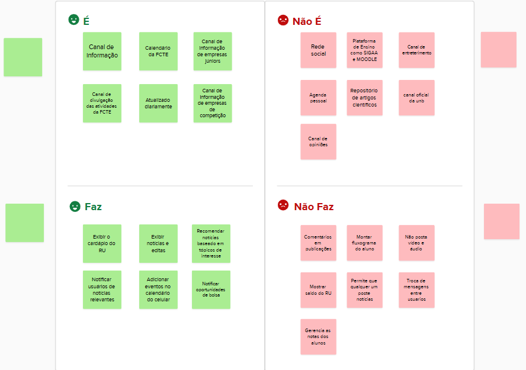

# 1.1.3. Decision

## Introdução

Nesta fase da Design Sprint, o objetivo é analisar todas as soluções esboçadas anteriormente e **decidir qual delas possui maior potencial para ser prototipada e testada**. Essa escolha é guiada por um processo estruturado, garantindo que todas as ideias sejam avaliadas de forma justa e alinhada ao escopo definido.

## Metodologia

Durante a fase de *Sketch*, cada integrante desenvolveu um Rich Picture representando sua compreensão do sistema. Em seguida, foi conduzida uma análise comparativa desses artefatos, considerando critérios como:

- Clareza visual;
- Abrangência dos elementos do sistema;
- Facilidade de entendimento;
- Alinhamento com os objetivos do projeto.

Além disso, foi realizada a técnica *É, Não É, Faz, Não Faz* para alinharmos o entendimento da equipe sobre uma solução em desenvolvimento

Esse processo colaborativo ocorreu na reunião do dia 01 de abril de 2026, registrada e disponível através deste [link]().

## Rich Picture Selecionado

O Rich Picture selecionado como representação principal do sistema foi o do **NOME**, por apresentar de forma clara, organizada e completa os principais atores, funcionalidades e interações do *FCTE Hoje*. Seu conteúdo facilitou a compreensão do contexto geral e dos fluxos de informação, tornando-o o mais adequado para orientar as próximas etapas.

<strong>Imagem 1: Rich Picture Selecionado </strong>

****

<em>Autor: <a href="">Adicionar_Nome</a></em>

## Diagrama É, Não É, Faz, Não Faz

<strong>Imagem 2: Diagrama É, Não É, Faz, Não Faz </strong>

****

<em>Autor: <a href="https://github.com/arthurgomes1290">Arthur Gomes</a>, <a href="https://github.com/ArthurGuilher62">Arthur Guilherme</a>, <a href="https://github.com/arthurhvieira1">Arthur Henrique</a>, <a href="https://github.com/felipegf1">Felipe Guimarães</a>, <a href="https://github.com/darkymeubem">Felipe Lopes Pedroza</a>, <a href="https://github.com/femathrl0">Felipe Matheus</a>, <a href="https://github.com/KauaVL">Kauã Vale</a>, <a href="https://github.com/pedromadbr">Pedro Miguel</a>, <a href="https://github.com/TiagoTeixeira-2005">Tiago Lemes</a> e <a href="https://github.com/VilmarFagundes">Vilmar Fagundes</a></em>

## Conclusão

A etapa de **Decision**, ao selecionar o *Rich Picture mais representativo* e realizar a técnica *É, Não É, Faz, Não Faz* , permitiu consolidar uma visão compartilhada do funcionamento do sistema e estabeleceu uma base sólida para o início da fase de **Prototype**, garantindo maior coerência e direcionamento no desenvolvimento da solução.

## Referência Bibliográfica

> GOOGLE.Design Sprint Kit: Decide. [Acessado em: 30 mar. 2026](https://designsprintkit.withgoogle.com/methodology/phase4-decide) 

## Histórico de versões
| Versão | Data | Descrição | Autor(es) | Revisor(es) | Data da revisão |
|--------|------|-----------|-----------|-------------|-----------------|
| `1.0` | 31/03/2026 | Criação e organização do documento. | [Tiago Lemes](https://github.com/TiagoTeixeira-2005)  | | |
