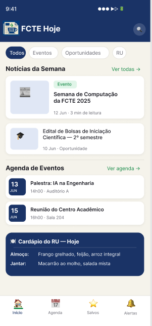
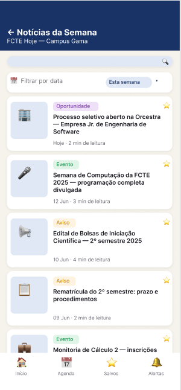
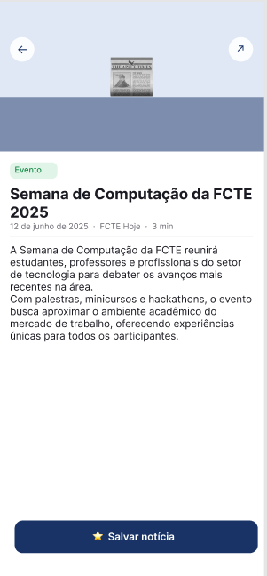
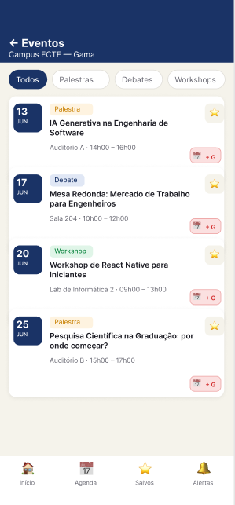
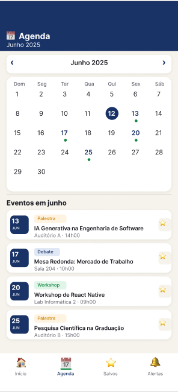
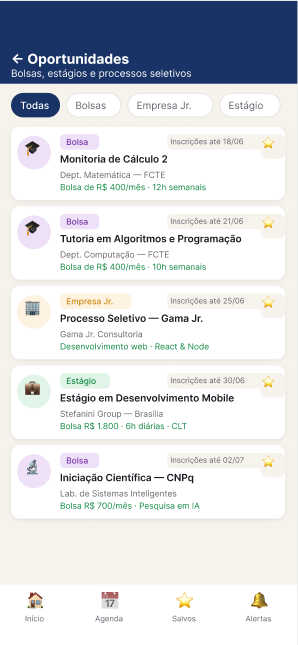
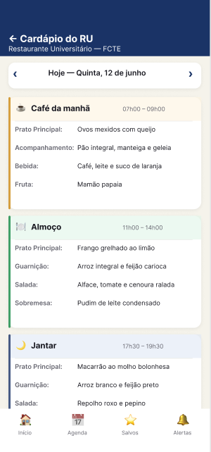
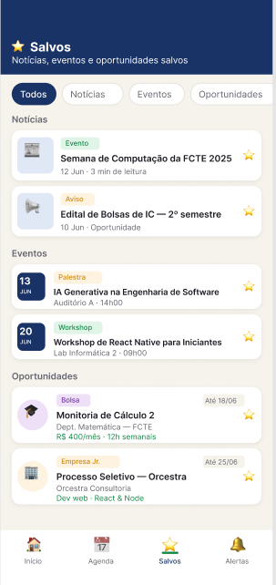
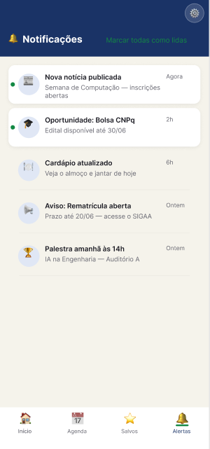
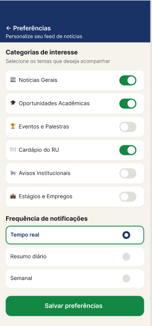

# 1.1.4. Prototype

## Introdução

De acordo com o *Design Sprint da Google*, a prototipagem consiste na **criação de uma versão preliminar de um produto**, neste caso, um software. Trata-se de um processo fundamental no ciclo de desenvolvimento, pois permite que a equipe visualize, teste e refine ideias antes de investir tempo e recursos na construção da versão final.

Em vez de desenvolver o produto completo de uma só vez, cria-se um protótipo que pode variar em fidelidade: desde esboços simples em papel até simulações interativas que se aproximam bastante do funcionamento real. Essa etapa é essencial para validar conceitos, testar fluxos de navegação e coletar feedback antecipado, reduzindo custos e evitando retrabalhos durante a implementação.

## Participantes

| Aluno  | Participação|
| -- | -- |
|  Arthur Gomes Oliveira | [Criação do Protótipo](https://unbarqdsw2026-1-turma01.github.io/-2026.1-T01-_G4_FCTE_Hoje_Entrega_01/#/Base/1.1.4.Prototype?id=prot%c3%b3tipo) |
|  Arthur Guilherme Aquino Santos | [Criação do Protótipo](https://unbarqdsw2026-1-turma01.github.io/-2026.1-T01-_G4_FCTE_Hoje_Entrega_01/#/Base/1.1.4.Prototype?id=prot%c3%b3tipo) |
|  Felipe Guimaraes Fernandes | [Criação do Protótipo](https://unbarqdsw2026-1-turma01.github.io/-2026.1-T01-_G4_FCTE_Hoje_Entrega_01/#/Base/1.1.4.Prototype?id=prot%c3%b3tipo)|
|  Felipe Lopes Pedroza |[Criação do Protótipo](https://unbarqdsw2026-1-turma01.github.io/-2026.1-T01-_G4_FCTE_Hoje_Entrega_01/#/Base/1.1.4.Prototype?id=prot%c3%b3tipo) |
|  Felipe Matheus Ribeiro Lopes |[Criação do Protótipo](https://unbarqdsw2026-1-turma01.github.io/-2026.1-T01-_G4_FCTE_Hoje_Entrega_01/#/Base/1.1.4.Prototype?id=prot%c3%b3tipo) |
|  Pedro Miguel Martins de Oliveira dos Santos |[Criação do Protótipo](https://unbarqdsw2026-1-turma01.github.io/-2026.1-T01-_G4_FCTE_Hoje_Entrega_01/#/Base/1.1.4.Prototype?id=prot%c3%b3tipo)|
|  Tiago Lemes Teixeira | Criação da documentação |

## Metodologia

Neste projeto, o protótipo foi desenvolvido com base nos artefatos produzidos anteriormente, especialmente no **Rich Picture selecionado** na fase de [Decision](/Base/1.1.3.Decision.md). Sua construção foi realizada na ferramenta Figma, buscando representar de forma preliminar e consistente os requisitos elicitados e contemplar os diferentes perfis de usuário.

## Protótipo

Desenvolvemos um protótipo de media fidelidade para ilustrar o funcionamento e a navegação do aplicativo **FCTE Hoje**. O foco principal é centralizar e facilitar o acesso a informações relevantes do campus, como notícias, eventos, oportunidades acadêmicas e o cardápio do Restaurante Universitário (RU).

Para a criação dos protótipos, utilizamos a ferramenta Figma, permitindo projetar e testar interfaces de forma eficiente e focada na experiência do estudante.

# 1. Tela Home (Início)

Apresenta o painel inicial com um resumo direto das notícias da semana, próximos eventos e o cardápio do RU do dia.

<em>
    Autor(es): 
    <a href="https://github.com/arthurgomes1290">Arthur Gomes Oliveira</a>, 
    <a href="https://github.com/ArthurGuilher62">Arthur Guilherme</a>, 
    <a href="https://github.com/felipegf1">Felipe Guimaraes</a>, 
    <a href="https://github.com/darkymeubem">Felipe Pedrosa</a>, 
    <a href="https://github.com/femathrl0">Felipe Matheus</a>, 
    <a href="https://github.com/pedromadbr">Pedro Miguel</a>
</em>

# 2. Notícias e Informações

## 2.1. Notícias da Semana

Feed com publicações recentes do campus, filtráveis por data.

<em>
    Autor(es): 
    <a href="https://github.com/arthurgomes1290">Arthur Gomes Oliveira</a>, 
    <a href="https://github.com/ArthurGuilher62">Arthur Guilherme</a>, 
    <a href="https://github.com/felipegf1">Felipe Guimaraes</a>, 
    <a href="https://github.com/darkymeubem">Felipe Pedrosa</a>, 
    <a href="https://github.com/femathrl0">Felipe Matheus</a>, 
    <a href="https://github.com/pedromadbr">Pedro Miguel</a>
</em>

## 2.2. Visualização de Notícia

Página focada na leitura completa de um artigo, edital ou aviso.

<em>
    Autor(es): 
    <a href="https://github.com/arthurgomes1290">Arthur Gomes Oliveira</a>, 
    <a href="https://github.com/ArthurGuilher62">Arthur Guilherme</a>, 
    <a href="https://github.com/felipegf1">Felipe Guimaraes</a>, 
    <a href="https://github.com/darkymeubem">Felipe Pedrosa</a>, 
    <a href="https://github.com/femathrl0">Felipe Matheus</a>, 
    <a href="https://github.com/pedromadbr">Pedro Miguel</a>
</em>

# 3. Eventos e Agenda

## 3.1. Tela de Eventos

Lista de atividades acadêmicas com abas para filtrar por Palestras, Debates e Workshops.

<em>
    Autor(es): 
    <a href="https://github.com/arthurgomes1290">Arthur Gomes Oliveira</a>, 
    <a href="https://github.com/ArthurGuilher62">Arthur Guilherme</a>, 
    <a href="https://github.com/felipegf1">Felipe Guimaraes</a>, 
    <a href="https://github.com/darkymeubem">Felipe Pedrosa</a>, 
    <a href="https://github.com/femathrl0">Felipe Matheus</a>, 
    <a href="https://github.com/pedromadbr">Pedro Miguel</a>
</em>

## 3.2. Tela de Agenda

Visualização mensal em formato de calendário indicando os dias com eventos programados.

<em>
    Autor(es): 
    <a href="https://github.com/arthurgomes1290">Arthur Gomes Oliveira</a>, 
    <a href="https://github.com/ArthurGuilher62">Arthur Guilherme</a>, 
    <a href="https://github.com/felipegf1">Felipe Guimaraes</a>, 
    <a href="https://github.com/darkymeubem">Felipe Pedrosa</a>, 
    <a href="https://github.com/femathrl0">Felipe Matheus</a>, 
    <a href="https://github.com/pedromadbr">Pedro Miguel</a>
</em>

# 4. Oportunidades e Utilidades

## 4.1. Tela de Oportunidades

Mural de vagas dividido em Bolsas, Empresas Jr. e Estágios.

<em>
    Autor(es): 
    <a href="https://github.com/arthurgomes1290">Arthur Gomes Oliveira</a>, 
    <a href="https://github.com/ArthurGuilher62">Arthur Guilherme</a>, 
    <a href="https://github.com/felipegf1">Felipe Guimaraes</a>, 
    <a href="https://github.com/darkymeubem">Felipe Pedrosa</a>, 
    <a href="https://github.com/femathrl0">Felipe Matheus</a>, 
    <a href="https://github.com/pedromadbr">Pedro Miguel</a>
</em>

## 4.2. Cardápio do RU

Exibe as opções de refeições do dia detalhadas (Café da manhã, Almoço e Jantar).

<em>
    Autor(es): 
    <a href="https://github.com/arthurgomes1290">Arthur Gomes Oliveira</a>, 
    <a href="https://github.com/ArthurGuilher62">Arthur Guilherme</a>, 
    <a href="https://github.com/felipegf1">Felipe Guimaraes</a>, 
    <a href="https://github.com/darkymeubem">Felipe Pedrosa</a>, 
    <a href="https://github.com/femathrl0">Felipe Matheus</a>, 
    <a href="https://github.com/pedromadbr">Pedro Miguel</a>
</em>

# 5. Área do Usuário

## 5.1. Salvos

Lista de acesso rápido para itens (Notícias, Eventos, Oportunidades) favoritados pelo usuário.

<em>
    Autor(es): 
    <a href="https://github.com/arthurgomes1290">Arthur Gomes Oliveira</a>, 
    <a href="https://github.com/ArthurGuilher62">Arthur Guilherme</a>, 
    <a href="https://github.com/felipegf1">Felipe Guimaraes</a>, 
    <a href="https://github.com/darkymeubem">Felipe Pedrosa</a>, 
    <a href="https://github.com/femathrl0">Felipe Matheus</a>, 
    <a href="https://github.com/pedromadbr">Pedro Miguel</a>
</em>

## 5.2. Notificações

Central de alertas (Alertas) sobre publicações, mudanças no cardápio ou prazos.

<em>
    Autor(es): 
    <a href="https://github.com/arthurgomes1290">Arthur Gomes Oliveira</a>, 
    <a href="https://github.com/ArthurGuilher62">Arthur Guilherme</a>, 
    <a href="https://github.com/felipegf1">Felipe Guimaraes</a>, 
    <a href="https://github.com/darkymeubem">Felipe Pedrosa</a>, 
    <a href="https://github.com/femathrl0">Felipe Matheus</a>, 
    <a href="https://github.com/pedromadbr">Pedro Miguel</a>
</em>

## 5.3. Preferências

Permite ao usuário customizar o feed selecionando categorias de interesse e a frequência das notificações.

<em>
    Autor(es): 
    <a href="https://github.com/arthurgomes1290">Arthur Gomes Oliveira</a>, 
    <a href="https://github.com/ArthurGuilher62">Arthur Guilherme</a>, 
    <a href="https://github.com/felipegf1">Felipe Guimaraes</a>, 
    <a href="https://github.com/darkymeubem">Felipe Pedrosa</a>, 
    <a href="https://github.com/femathrl0">Felipe Matheus</a>, 
    <a href="https://github.com/pedromadbr">Pedro Miguel</a>
</em>

--- 

# Protótipo no Figma
Confira o protótipo interativo no Figma.

<iframe style="border: 1px solid rgba(0, 0, 0, 0.1);" width="800" height="450" src="https://embed.figma.com/design/9KgeJE79i9UvOKBoeFGhSX/FCTE-Hoje-%E2%80%94-Prot%C3%B3tipo-M%C3%A9dia-Fidelidade?node-id=0-1&embed-host=share" allowfullscreen></iframe>

<em>
    Autor(es): 
    <a href="https://github.com/arthurgomes1290">Arthur Gomes Oliveira</a>, 
    <a href="https://github.com/ArthurGuilher62">Arthur Guilherme</a>, 
    <a href="https://github.com/felipegf1">Felipe Guimaraes</a>, 
    <a href="https://github.com/darkymeubem">Felipe Pedrosa</a>, 
    <a href="https://github.com/femathrl0">Felipe Matheus</a>, 
    <a href="https://github.com/pedromadbr">Pedro Miguel</a>
</em>

## Referência Bibliográfica

> GOOGLE.Design Sprint Kit: Prototype. [Acessado em: 30 mar. 2026](https://designsprintkit.withgoogle.com/methodology/phase5-prototype)

## Histórico de versões
| Versão | Data | Descrição | Autor(es) | Revisor(es) | Data da revisão |
|--------|------|-----------|-----------|-------------|-----------------|
| `1.0` | 31/03/2026 | Criação e organização do documento. | [Tiago Lemes](https://github.com/TiagoTeixeira-2005)  | | |
| `1.1` | 31/03/2026 | Adição de conteúdos e organização do documento. | [Felipe Matheus](https://github.com/femathrl0)  | | |
