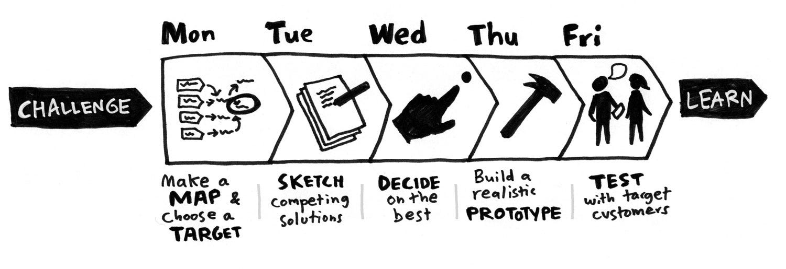

# 1.1. Design Sprint

## Introdução

O Design Sprint é uma metodologia criada pelo Google Ventures para validar ideias e resolver grandes desafios de negócio em apenas cinco dias, por meio de um processo dividido em fases bem definidas.

A proposta do Sprint é acelerar o aprendizado: em vez de gastar meses debatendo possibilidades ou esperar o lançamento de um produto mínimo para avaliar sua aceitação, a equipe constrói em poucos dias um protótipo realista e coleta feedback direto dos usuários-alvo.

Esse processo permite visualizar como seria o produto final e compreender como os clientes reagiriam a ele antes de assumir custos altos ou riscos desnecessários. Dessa forma, transforma incertezas em insights concretos, reduzindo o tempo de desenvolvimento e aumentando a assertividade na tomada de decisões.

## Fases do Design Sprint

Conforme o Design Sprint Kit, inspirado no método do Google Ventures, o processo é dividido em cinco fases principais, apresentadas na Figura 1, cada uma com um objetivo próprio.

<strong>Figura 1: Fases do Design Sprint </strong>

****

### [Unpack](/Base/1.1.1.Unpack.md)

Essa fase consiste em compartilhar informações, levantar hipóteses, analisar o contexto, entender os usuários e mapear os principais desafios. Entrevistas, discussões abertas e análises colaborativas ajudam a alinhar o conhecimento de toda a equipe e construir uma visão comum do problema.

No contexto deste projeto, essa etapa foi conduzida por meio das seguintes técnicas:

- [5W2H](/Base/1.1.1.1.5w2h.md): Foram respondidas as perguntas *What, Why, Where, When, Who, How e How Much*, a fim de proporcionar uma visão inicial clara e completa sobre o projeto e suas necessidades.
- [Brainstorming](/Base/1.1.1.2.Brainstorming.md): Ideias foram coletadas e requisitos foram elicitados com o objetivo de aprofundar a compreensão das necessidades dos usuários, complementando os resultados obtidos pelo Questionário.
- [Diagrama de Causa e Efeito](/Base/1.1.1.3.DiagramaCausaEfeito.md): Utilizado para identificar as possíveis causas dos problemas levantados, organizando fatores que influenciam o cenário analisado.
- [Questionário](/Base/1.1.1.4.Questionario.md): Aplicado para coletar informações diretamente de um conjunto de stakeholders, permitindo compreender percepções, necessidades e expectativas relacionadas ao sistema.

### [Sketch](/Base/1.1.2.Sketch.md)

A partir do entendimento consolidado, cada participante elabora propostas de solução de forma visual. O objetivo é explorar ideias criativas, identificar possibilidades e transformar conceitos em esboços que sirvam de base para a etapa de decisão.

No contexto deste projeto, essa etapa foi conduzida por meio das seguinte técnica:

-  [Rich Picture](/Base/1.1.2.1.RichPicture.md): Utilizada para explorar e comunicar a complexidade de sistemas de forma simples e intuitiva, representando os principais elementos envolvidos — como indivíduos, processos, fluxos de informação, armazenamentos de dados, limites e possíveis problemas.

### [Decision](/Base/1.1.3.Decision.md)

As ideias apresentadas na etapa anterior são discutidas em grupo. A equipe analisa os pontos fortes e fracos de cada proposta, identifica padrões e seleciona as soluções mais promissoras para seguir adiante.

No contexto deste projeto, essa etapa foi conduzida por meio das seguintes técnicas:

- [Rich Picture Escolhido](/Base/1.1.2.1.RichPicture.md): Com base nos Rich Pictures gerados, foi selecionado aquele que melhor representa o sistema, por apresentar de forma clara, organizada e completa os principais atores, funcionalidades e interações relacionadas ao FCTE Hoje.
- [É -Não é - Faz - Não faz](): Utilizada para delimitar o escopo do sistema, definindo claramente o que ele é e não é, bem como o que faz e não faz. Essa análise ajudou na tomada de decisão, garantindo que a proposta escolhida permanecesse alinhada aos objetivos do projeto.

### [Prototype](/Base/1.1.4.Prototype.md)

Aqui, a equipe cria um protótipo funcional e interativo, que simula a experiência final do usuário. A prioridade é a velocidade: o protótipo não precisa ser perfeito, mas deve ser convincente o suficiente para que possa ser avaliado de forma realista.

No contexto deste projeto, essa etapa foi realizada através da realização de um [Protótipo de Alta Fidelidade](/Base/1.1.4.Prototype.md), isto é, uma representação visual detalhada que se aproxima da interface final do aplicativo. 

### [Validate](/Base/1.1.5.Validate.md)

Na fase final, o protótipo é testado com usuários reais. A equipe observa suas interações, coleta feedback e identifica pontos de melhoria. Essa etapa é essencial para validar se a solução realmente atende às necessidades do público-alvo e para orientar ajustes futuros, garantindo que o desenvolvimento avance com segurança e embasamento.

No contexto deste projeto, essa etapa foi realizada através …

## Referência Bibliográfica
> The Design Sprint. Google Ventures, 2019. [Acessado em: 01 abr. 2026](https://www.gv.com/sprint/). 

## Histórico de versões
| Versão | Data | Descrição | Autor(es) | Revisor(es) | Data da revisão |
|--------|------|-----------|-----------|-------------|-----------------|
| `1.0` | 01/04/2026 | Criação e organização do documento | [Tiago Lemes](https://github.com/TiagoTeixeira-2005)  | | |

