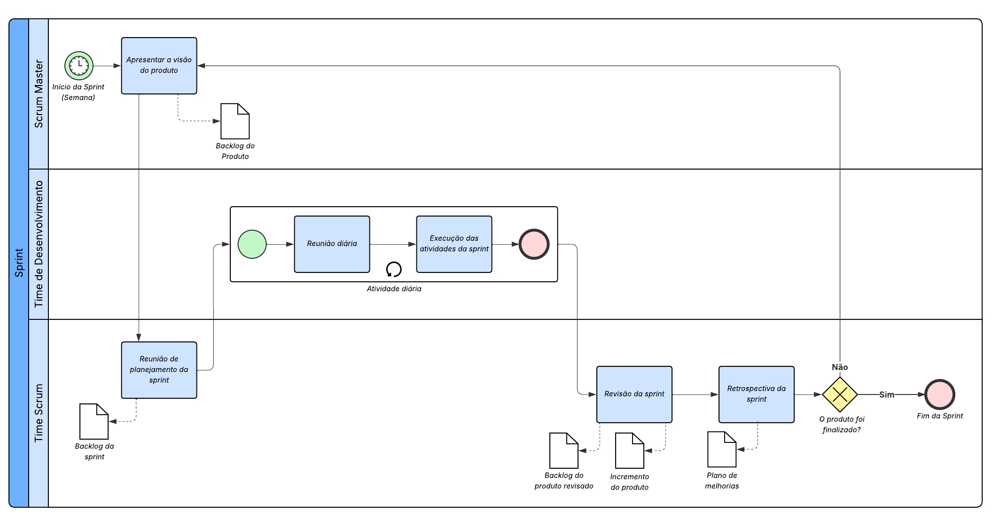
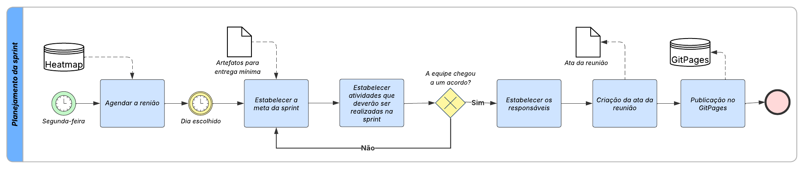
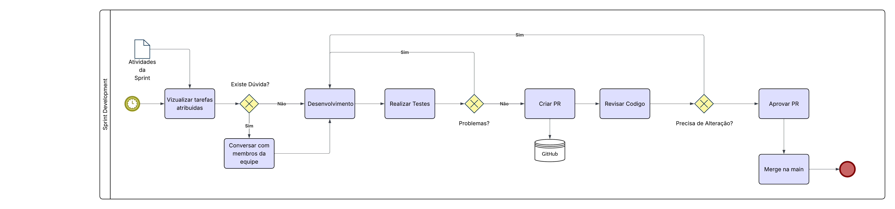
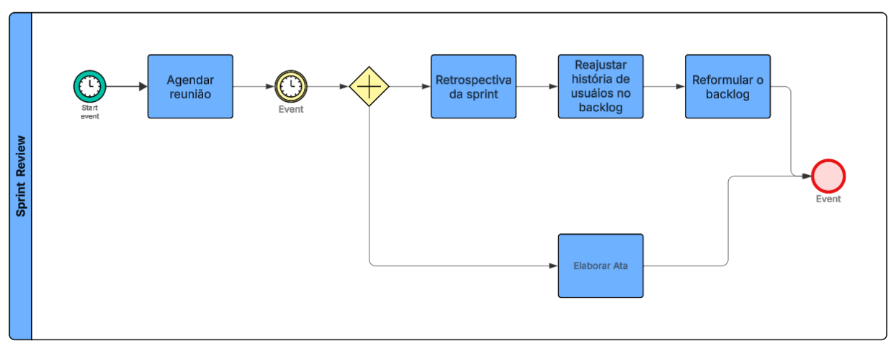

# 1.3. Modelagem BPMN

## Introdução

A **Business Process Model and Notation (BPMN)** é uma notação padronizada para modelagem de processos de negócio, criada para facilitar a representação visual de fluxos de trabalho complexos. Ela permite que analistas de negócio, desenvolvedores e stakeholders tenham uma compreensão comum sobre processos organizacionais, reduzindo ambiguidades e promovendo clareza nas decisões.

## Participantes

| Aluno  | Participação|
| -- | -- |
|  Arthur Gomes Oliveira | |
|  Arthur Guilherme Aquino Santos | Criação da [Sprint Review](https://unbarqdsw2026-1-turma01.github.io/-2026.1-T01-_G4_FCTE_Hoje_Entrega_01/#/Base/1.3.ModelagemBPMN?id=sprint-review) |
|  Arthur Henrique Vieira | Criação da [Sprint Development](https://unbarqdsw2026-1-turma01.github.io/-2026.1-T01-_G4_FCTE_Hoje_Entrega_01/#/Base/1.3.ModelagemBPMN?id=sprint-development) |
|  Felipe Guimaraes Fernandes | |
|  Felipe Lopes Pedroza | Criação da [Sprint Review](https://unbarqdsw2026-1-turma01.github.io/-2026.1-T01-_G4_FCTE_Hoje_Entrega_01/#/Base/1.3.ModelagemBPMN?id=sprint-review)  |
|  Felipe Matheus Ribeiro Lopes | |
|  Kauã Vale Leão | Criação da [Sprint Development](https://unbarqdsw2026-1-turma01.github.io/-2026.1-T01-_G4_FCTE_Hoje_Entrega_01/#/Base/1.3.ModelagemBPMN?id=sprint-development) |
|  Pedro Miguel Martins de Oliveira dos Santos | |
|  Tiago Lemes Teixeira | Criação da [Sprint Geral](https://unbarqdsw2026-1-turma01.github.io/-2026.1-T01-_G4_FCTE_Hoje_Entrega_01/#/Base/1.3.ModelagemBPMN?id=sprint-geral), [Sprint Planning](https://unbarqdsw2026-1-turma01.github.io/-2026.1-T01-_G4_FCTE_Hoje_Entrega_01/#/Base/1.3.ModelagemBPMN?id=sprint-planning) e criação da documentação |
|  Vilmar José Fagundes  | Criação da [Sprint Geral](https://unbarqdsw2026-1-turma01.github.io/-2026.1-T01-_G4_FCTE_Hoje_Entrega_01/#/Base/1.3.ModelagemBPMN?id=sprint-geral) e [Sprint Planning](https://unbarqdsw2026-1-turma01.github.io/-2026.1-T01-_G4_FCTE_Hoje_Entrega_01/#/Base/1.3.ModelagemBPMN?id=sprint-planning) |

## Metodologia

Os diagramas **BPMN desenvolvidos neste projeto foram elaborados com base no framework Scrum**, cujo propósito é organizar, monitorar e iterar continuamente sobre o desenvolvimento das tarefas. Embora o modelo original tenha sido utilizado como referência, algumas adaptações foram necessárias para adequá-lo ao contexto do projeto. A escolha pelo Scrum se justificou pelo fato de que todos os membros da equipe já possuíam experiência prévia em trabalhos acadêmicos utilizando esse framework, além de que o formato de entregas constantes da disciplina se alinha naturalmente à lógica de sprints.

No processo adotado, o trabalho é estruturado em sprints, períodos curtos e regulares nos quais a equipe planeja, executa e revisa as atividades, garantindo entregas incrementais e promovendo a melhoria contínua. Cada tarefa é registrada no backlog, priorizada conforme sua relevância e acompanhada por meio de reuniões diárias e demais cerimônias previstas no Scrum, assegurando transparência, colaboração e controle sobre o progresso do projeto.

Além disso, foi desenvolvido um **diagrama BPMN representando o fluxo completo da aplicação**, descrevendo de maneira estruturada todas as interações entre o sistema e os diferentes tipos de usuários. Esse diagrama possibilita visualizar o funcionamento global da solução, facilitando a análise, comunicação e validação dos processos envolvidos.

## Modelagem da Metodologia Scrum

### Sprint Geral

O diagrama abaixo representa o fluxo padrão, com algumas adaptações, da metodologia Scrum utilizada no projeto. Ele foi desenvolvido a partir de um modelo apresentado pelo professor do INESC TEC, Rafael Ris-Ala, disponível neste [link](https://media.licdn.com/dms/image/v2/C5612AQGWR7AQWF4K4Q/article-cover_image-shrink_720_1280/article-cover_image-shrink_720_1280/0/1520165975270?e=1776902400&v=beta&t=j2phdmbh8Z8V2eNtyVGCmP2PDz8qtXlmkidNbZk8QRY).

<strong>Figura 1: Modelagem BPMN da Sprint Geral </strong>

****

<em>Autor: <a href="https://github.com/TiagoTeixeira-2005">Tiago Lemes</a> e <a href="https://github.com/VilmarFagundes">Vilmar José</a></em>

### Sprint Planning
O diagrama abaixo representa o fluxo de atividades realizadas durante o planejamento da sprint. O processo se inicia com a definição do horário da reunião, considerando a disponibilidade da equipe registrada no Heatmap. Em seguida, a meta da sprint é discutida, juntamente com as atividades que deverão ser executadas, com base nos artefatos mínimos exigidos para a entrega.

Após essa etapa, o grupo atribui responsáveis para cada atividade e elabora a ata da reunião, que documenta as decisões tomadas. Por fim, todos os registros são publicados no GitPages, garantindo organização, rastreabilidade e transparência no andamento do projeto.

<strong>Figura 2: Modelagem BPMN da Sprint Planning</strong>

****

<em>Autor: <a href="https://github.com/TiagoTeixeira-2005">Tiago Lemes</a> e <a href="https://github.com/VilmarFagundes">Vilmar José</a></em>

### Sprint Development

O diagrama abaixo representa o fluxo de atividades realizadas durante o desenvolvimento da sprint. O processo se inicia com o início da sprint, com base nas definições do planejamento.

Em seguida, a equipe visualiza as tarefas e, em caso de dúvidas, realiza alinhamentos antes de iniciar o desenvolvimento das funcionalidades. Durante essa etapa, são realizados testes para validação.

Caso sejam identificados problemas, as atividades retornam para desenvolvimento. Após a validação, é criado o Pull Request, que passa por revisão de código, podendo retornar para ajustes ou ser integrado ao projeto.

<strong>Figura 3: Modelagem BPMN da Sprint Development</strong>

****

<em>Autor: <a href="https://github.com/KauaVL">Kauã Vale Leão</a> e <a href="https://github.com/arthurhvieira1">Arthur Henrique Vieira</a></em>

### Sprint Review
O diagrama abaixo representa o fluxo de atividades realizadas durante a Review da sprint. O processo se inicia com a definição do horário da reunião, considerando a disponibilidade da equipe registrada no Heatmap. Em seguida, uma restropectiva sobre a sprint é iniciada, juntamente com a elaboração da ata,que documenta as decisões tomadas.

Após essa etapa, o grupo reajusta as histórias de usuários com base no em seus estado, sendo concluidos ou ainda em desenvolvimento. Por fim, o backlog é reformulado com base no desenvolvimento nas histórias de usuários desenvolvidas ou que ainda precisam ser desenvolvidos.

<strong>Figura 4: Modelagem BPMN da Sprint Review</strong>

****

<em>Autor: <a href="https://github.com/ArthurGuilher62">Arthur Guilherme</a> e <a href="https://github.com/darkymeubem">Felipe Pedrosa</a></em>

## Modelagem do FCTE Hoje

## Conclusão

A utilização da notação BPMN neste projeto visa facilitar a comunicação entre a equipe técnica e as partes interessadas, além de auxiliar na documentação e no entendimento dos fluxos relacionados à experiência do usuário e à metodologia adotada. A modelagem permite identificar gargalos, oportunidades de melhoria e pontos críticos do processo, oferecendo uma visão estruturada que apoia tanto o planejamento quanto as decisões futuras.

## Referências Bibliográficas

> OBJECT MANAGEMENT GROUP. Business Process Model and Notation (BPMN) Version 2.0.2. Needham: Object Management Group, 2013. [Acessado em: 30 mar. 2026](https://www.omg.org/spec/BPMN/2.0.2/PDF). 

## Histórico de versões
| Versão | Data | Descrição | Autor(es) | Revisor(es) | Data da revisão |
|--------|------|-----------|-----------|-------------|-----------------|
| `1.0` | 30/03/2026 | Criação e organização do documento. | [Tiago Lemes](https://github.com/TiagoTeixeira-2005)  | [Vilmar José](https://github.com/VilmarFagundes) | 02/04/2026 |
| `1.1` | 03/04/2026 | Adição do BPMN da Sprint Geral e do Sprint Planning. | [Tiago Lemes](https://github.com/TiagoTeixeira-2005)  | [Vilmar José](https://github.com/VilmarFagundes) | 03/04/2026 |
| `1.2` | 03/04/2026 | Adição do BPMN dos documentos referentes a Sprint Geral e do Sprint Planning. | [Vilmar José](https://github.com/VilmarFagundes) | [Tiago Lemes](https://github.com/TiagoTeixeira-2005) | 03/04/2026 |
| `1.3` | 05/04/2026 | Adição do BPMN dos documentos referentes a Review Sprint. | [Arthur Guilherme](https://github.com/ArthurGuilher62) | [Felipe Pedrosa](https://github.com/darkymeubem) | 05/04/2026 |
| `1.4` | 05/04/2026 | Adição do BPMN dos documentos referentes a Sprint Development. | [Kauã Vale](https://github.com/KauaVL) | [Arthur Henrique](https://github.com/arthurhvieira1) | 05/04/2026 |

